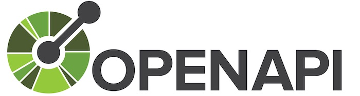

<p align="center">
    
</p>

# Django REST framework OpenAPI Schema generation

This is a sample project with Django REST framework schema generation and React API client generated from the schema.  

## Technologies

**API**
 - Python 3
 - Django 5
 - Django REST Framework
 - drf-spectacular

Frontend
- React
- orval
- yarn
- Typescript

## Getting started

**Django API**

Create a new Python virtual environment
```shell
python -m venv .venv
```

Activate the virtual environment
```shell
source .venv/bin/activate
```

Install required packages
```shell
python -m pip install -r requirements.txt
```

Run Django server
```shell
python manage.py runserver
```

Frontend application

1. Make sure you have Node installed
2. Install modules `yarn install`
4. Run `yarn dev`
